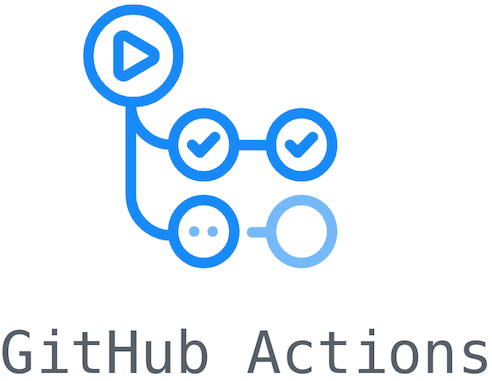

[](https://www.java.com/pt-BR/)
[](https://maven.apache.org/)
[](https://junit.org/junit5/)
[](https://opensource.org/licenses/MIT)

<p align="center">
    
</p>

# Tópicos

- [Introdução](README.md#introdução)
- [Projeto e Repositório](README.md#projeto-e-repositório)
- [Configuração](README.md#configuração)
- [Execução](README.md#execução)
- [Tecnologias](README.md#tecnologias)
- [Referências](README.md#referências)
- [Autores](README.md#autores)

# Introdução

O Github Actions permite que você crie fluxos de trabalho personalizados do ciclo de vida de desenvolvimento de software diretamente no seu repositório Github. Esses fluxos de trabalho são compostos por diferentes tarefas, chamadas ações, que podem ser executadas automaticamente em determinados eventos. Isso permite que você inclua recursos de integração contínua (CI) e implantação contínua (CD) e muitos outros recursos diretamente em seu repositório.

Esta apresentação demonstra a configuração e uso do GA (Github Actions) em um repositório de um projeto java. O projeto java utilizado foi criado usando o Maven. O maven faz uso de um arquivo xml geralmente chamado ‘pom.xml’ que descreve tudo o que maven precisa e pode fazer para testar, buildar e empacotar aquele projeto.

# Projeto e repositório

Crie um projeto usando maven e o coloque em um repositório no github

Usando o maven é possível criar um projeto java básico:

```bash
mvn archetype:generate \
    -DgroupId=br.ufpe.cinmoto.testingtools_ga.app \
    -DartifactId=testingtools_ga \
    -DarchetypeArtifactId=maven-archetype-quickstart \
    -DarchetypeVersion=1.4 \
    -DinteractiveMode=false
```

## Configurando o arquivo de configuração POM.xml

Propriedades no arquivo POM.xml:

```xml
<properties>
    <project.build.sourceEncoding>UTF-8</project.build.sourceEncoding>
    <maven.compiler.source>1.8</maven.compiler.source>
    <maven.compiler.target>1.8</maven.compiler.target>
</properties>
```

Depedências no arquivo POM.xml:

```xml
<dependencies>
    <dependency>
        <groupId>junit</groupId>
        <artifactId>junit</artifactId>
        <version>4.11</version>
        <scope>test</scope>
    </dependency>
    <dependency>
        <groupId>com.github.stefanbirkner</groupId>
        <artifactId>system-rules</artifactId>
        <version>1.19.0</version>
        <scope>test</scope>
    </dependency>
</dependencies>
```

Artefato no repositório Maven:

```xml
<groupId>br.ufpe.cinmoto.ga_tutorial.app</groupId>
<artifactId>ga_tutorial</artifactId>
<version>1.0-SNAPSHOT</version>
```

## Classes do Domínio

Conta:

```java
public class Conta {

    private String nome;
    private int saldo;
    private int credito;

    public Conta(String nome, int saldo, int credito) {
        this.nome = nome;
        this.saldo = saldo;
        this.credito = credito;
    }

    public void saque(int valor) {
        if (saldo >= valor) {
            saldo = saldo - valor;
        } else {
            throw new SaldoNaoSuficienteException("Você não possui saldo suficiente");
        }
    }

    public void deposito(int valor) {
        saldo = saldo + valor;
    }

    public void transferenciaDoc(int valor) {
        if (valor > 500) {
            throw new TransferenciaException("Valor máximo para transferência DOC: R$ 5.000,00");
        }
        saldo = saldo - valor;
    }

    public void pagarConta(int valor) {
        if (saldo >= valor) {
            saldo = saldo - valor;
        } else if (saldo + credito >= valor) {
            credito = credito - valor;
            credito = credito + saldo;
            saldo = 0;
        } else {
            throw new SaldoNaoSuficienteException("Você não possui saldo nem crédito suficientes");
        }
    }

    public int saldo() {
        return saldo;
    }

    public int credito() {
        return credito;
    }
}
```

Exceção de Saldo não Suficiente:

```java
public class SaldoNaoSuficienteException extends RuntimeException {

    private static final long serialVersionUID = 1L;

    public SaldoNaoSuficienteException(String string) {
        super(string);
    }
}
```

Exceção de Saldo não Suficiente:

```java
public class TransferenciaException extends RuntimeException {

    private static final long serialVersionUID = 1L;

    public TransferenciaException(String string) {
        super(string);
    }
}
```


## Classe Com Testes Unitários

ContaTest:

```java
public class ContaTest {

    Conta conta;

    @Rule
    public final SystemOutRule systemOutRule = new SystemOutRule().enableLog();

    @Before
    public void initConta() {
        conta = new Conta("user", 50, 100);
    }

    @Test
    public void testDeposito() {
        conta.deposito(50);
        assertEquals(100,  conta.saldo());
    }

    @Test
    public void testSaque() {
        conta.saque(30);
        assertEquals(20, conta.saldo());

        conta.saque(20);
        assertEquals(0, conta.saldo());

        conta.deposito(88);
        conta.saque(8);
        assertEquals(80, conta.saldo());
    }

    @Test
    public void testTransferencia() {
        conta.transferenciaDoc(25);
        assertEquals(25, conta.saldo());

        conta.transferenciaDoc(20);
        assertEquals(5, conta.saldo());
    }

    @Test
    public void testPagar() {
        conta.pagarConta(10);
        assertEquals(40, conta.saldo());

        conta.pagarConta(140);
        assertEquals(0, conta.saldo());
        assertEquals(0, conta.credito());
    }

    @Test
    public void testCredito() {
        assertEquals(100, conta.credito());
    }

    @Test(expected = SaldoNaoSuficienteException.class)
    public void testSaldoExcepetion() {
        conta.saque(100);
    }

    @Test(expected = SaldoNaoSuficienteException.class)
    public void testPagarExcepetion() {
        conta.pagarConta(500);
    }

    @Test(expected = TransferenciaException.class)
    public void testTransferenciaException() {
        conta.transferenciaDoc(501);
    }

    @Test
    public void testTransferenciaExceptionBoundary() {
        conta.transferenciaDoc(500);
        assertEquals(-450,  conta.saldo());
    }
}
```

# Configuração

Configurando o repositório para usar Github Actions

Em seu repositório clique na aba "`actions`":


Sugestões aparecerão baseadas no projeto:


Na sugestão ‘Java with Maven’ clique em  "`set up this workflow`":


Aparecerá este editor de texto abaixo:


Preencha o editor de texto com o conteúdo abaixo respeitando a indentação mostrada.


Após isso clique no botão para fazer o commit "`start commit`":


# Execução

Github Actions em _ação_ - acompanhando o seu workflow.

Agora na aba "`Actions`" será possível acompanhar as execuções dos workflows do repositório:


Cada execução será acionada automaticamente a partir de eventos que definimos no arquivo do workflow (push e pull request). Nesse caso o evento foi um push do commit que fizemos do novo arquivo (maven.yml). Com certeza esta é a primeira execução de qualquer repositório que passe a usar o GA.

Clicando na execução em andamento do workflow que adicionamos, temos a seguinte página:


Na lateral esquerda clicando em build (nome do job) podemos ver sua execução de forma mais detalhada:


Ao fim de uma execução bem sucedida (todos os testes passaram) é possível fazer download do artefato (.jar) zipado.

[Follow](images/11%20-%20fim_da_execucao.png)

# Tecnologias

- [Java](https://www.java.com/pt-BR/) - Java é uma linguagem de programação baseada em classes e orientada a objetos
- [Junit](https://junit.org/junit5/) - JUnit é uma das estruturas de teste unitário mais populares no ecossistema Java
- [Maven](https://maven.apache.org/) -  Maven é ferramenta de gerenciamento e automação de depedências
- [Github Actions](https://github.com/features/actions) - tecnologia que automatiza todo fluxo de trabalho no desenvolvimento de software, adotando as premissas da filosofia CI / CD. A tecnologia permite a criação, teste e implantação seu código-fonte direto do GitHub.

# Referências

- [Iniciando com  Maven em Cinco Minutos](https://maven.apache.org/guides/getting-started/maven-in-five-minutes.html)
- [Mexendo no Arquivo Pom.xml](https://maven.apache.org/pom.html)
- [Construindo e Testando Java com Maven](https://docs.github.com/en/free-pro-team@latest/actions/guides/building-and-testing-java-with-maven)
- [Sobre Github Actions](https://github.com/features/actions)
- [Introdução ao Github Actions](https://gabrieltanner.org/blog/an-introduction-to-github-actions)
- [Documentação do Github Actions](https://docs.github.com/pt/free-pro-team@latest/actions)

# Autores

- [@aretw0](https://github.com/aretw0) - Arthur Aleksandro
- [@jV1ct0r](https://github.com/jV1ct0r) - João Victor
- [@Telemaco98](https://github.com/Telemaco98) - Shirley Ohara
- [@ruanmed](https://github.com/ruanmed) - Ruan Bahia
- [@jcrbsa](https://github.com/jcrbsa) - Richardson Bruno

# Licença :warning:

Este projeto é licenciado sobre a licença MIT.

Veja o arquivo [LICENSE](LICENSE) para detalhes da licença.

Copyright © 2020 CIN-Motorola FPDS GA WorkGroup,

Permission is hereby granted, free of charge, to any person obtaining a copy of this software and associated documentation files (the “Software”), to deal in the Software without restriction, including without limitation the rights to use, copy, modify, merge, publish, distribute, sublicense, and/or sell copies of the Software, and to permit persons to whom the Software is furnished to do so, subject to the following conditions:

The above copyright notice and this permission notice shall be included in all copies or substantial portions of the Software.

	THE SOFTWARE IS PROVIDED “AS IS”, WITHOUT WARRANTY OF ANY KIND, EXPRESS OR IMPLIED, INCLUDING BUT
	NOT LIMITED TO THE WARRANTIES OF MERCHANTABILITY, FITNESS FOR A PARTICULAR PURPOSE AND NONINFRINGEMENT.
	IN NO EVENT SHALL THE AUTHORS OR COPYRIGHT HOLDERS BE LIABLE FOR ANY CLAIM,
	DAMAGES OR OTHER LIABILITY, WHETHER IN AN ACTION OF CONTRACT, TORT OR OTHERWISE, ARISING FROM,
	OUT OF OR IN CONNECTION WITH THE SOFTWARE OR THE USE OR OTHER DEALINGS IN THE SOFTWARE.
